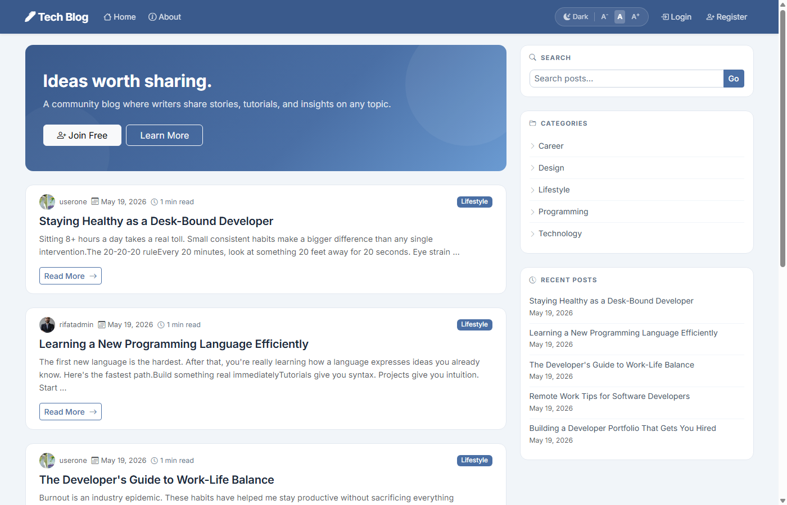
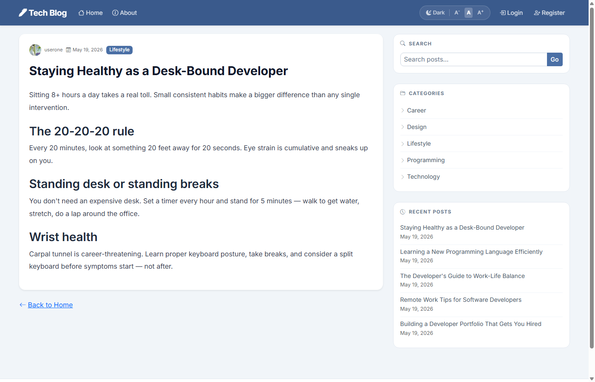
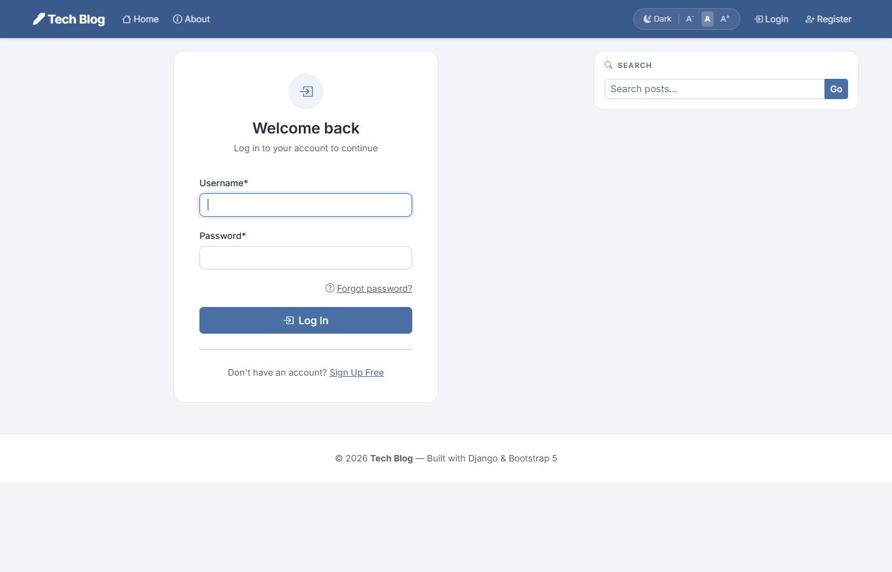

# Django Blog

A multi-author blogging platform built with Django 6 and Bootstrap 5. Any registered user can write, manage, and publish posts. Visitors can browse, search, and read without an account.

[](https://choosealicense.com/licenses/mit/)
[](https://www.python.org/)
[](https://www.djangoproject.com/)

---

## Screenshots

| Homepage (Guest) | Post Detail | Login |
|---|---|---|
|  |  |  |

---

## Features

### Content
| Feature | Description |
|---|---|
| Multi-author posts | Any registered user can create, edit, and delete their own posts |
| Rich text editor | Summernote WYSIWYG — bold, headings, images, code blocks, tables |
| Cover images | Optional cover photo per post |
| Draft / Published | Save posts as drafts before going live |
| Categories | Organise posts by category; click to filter |
| Tags | Add multiple tags per post; click to filter |
| Search | Full-text search across title and content |

### Reading Experience
| Feature | Description |
|---|---|
| Mark as Read | Toggle a post as read — persists across sessions |
| Save for Later | Bookmark posts to your reading list |
| Reading List | Dedicated page with Saved / Read History tabs and filters |
| Homepage filters | Filter by All / Unread / Read / Saved |
| Reading time | Estimated read time shown on each card |
| Pagination | Configurable posts-per-page via Site Settings |

### Users & Auth
| Feature | Description |
|---|---|
| Registration & login | Standard username/password auth |
| Forgot password | Email-based reset flow (console backend in dev, SMTP in prod) |
| User profiles | Avatar, join date, post count, read count, saved count |
| Profile editing | Update username, email, and profile picture |

### UI & UX
| Feature | Description |
|---|---|
| Dark / Light theme | Toggle with localStorage persistence (no flash on load) |
| Font size toggle | Small / Medium / Large — persists across pages |
| Responsive layout | Mobile-first Bootstrap 5, works on all screen sizes |
| Sticky sidebar | Search, categories, recent posts always in view |
| Toast notifications | Colour-coded success / error / info messages |
| Hero banner | Shown to guests; configurable text via admin |

### Admin & Config
| Feature | Description |
|---|---|
| Site Settings | Singleton admin model — update site name, tab title, hero text, about page, posts per page |
| Full Django admin | Manage posts, categories, tags, users, read/saved records |
| `.env` config | All secrets and environment-specific settings in `.env` |

---

## Tech Stack

- **Backend:** Python 3.13, Django 6.0
- **Database:** PostgreSQL
- **Frontend:** Bootstrap 5.3, Bootstrap Icons 1.11
- **Font:** Inter (Google Fonts)
- **Editor:** django-summernote
- **Forms:** django-crispy-forms + crispy-bootstrap5
- **Images:** Pillow
- **Config:** python-dotenv

---

## Local Setup

### 1. Clone the repository

```bash
git clone https://github.com/Rifat-47/Blog-Project-in-Django.git
cd Blog-Project-in-Django
```

### 2. Create and activate a virtual environment

```bash
# Windows
py -3.13 -m venv venv
venv\Scripts\activate

# macOS / Linux
python3.13 -m venv venv
source venv/bin/activate
```

### 3. Install dependencies

```bash
pip install -r requirements.txt
```

### 4. Configure environment variables

```bash
copy .env.example .env   # Windows
cp .env.example .env     # macOS / Linux
```

Edit `.env` with your values:

```env
DB_NAME=blog_db
DB_USER=postgres
DB_PASSWORD=your_password
DB_HOST=localhost
DB_PORT=5432

SECRET_KEY=your_secret_key
DEBUG=True
ALLOWED_HOSTS=localhost,127.0.0.1

# Leave EMAIL_HOST blank to print reset links to the terminal (dev mode)
EMAIL_HOST=
EMAIL_PORT=587
EMAIL_USE_TLS=True
EMAIL_HOST_USER=
EMAIL_HOST_PASSWORD=
DEFAULT_FROM_EMAIL=
```

### 5. Create the PostgreSQL database

```sql
CREATE DATABASE blog_db;
```

### 6. Run migrations

```bash
python manage.py migrate
```

### 7. Create a superuser

```bash
python manage.py createsuperuser
```

### 8. Run the development server

```bash
python manage.py runserver
```

Open [http://127.0.0.1:8000](http://127.0.0.1:8000) in your browser.

> **Admin panel:** [http://127.0.0.1:8000/admin](http://127.0.0.1:8000/admin) — configure Site Settings here on first run.

---

## Project Structure

```
Blog-Project-in-Django/
├── blog/                        # Core app
│   ├── migrations/
│   ├── templates/blog/
│   ├── static/blog/main.css
│   ├── models.py                # Post, Category, Tag, ReadPost, SavedPost, SiteSettings
│   ├── views.py                 # All blog views + AJAX toggle endpoints
│   ├── forms.py                 # PostForm
│   ├── context_processors.py   # reading_stats, site_settings (injected globally)
│   └── urls.py
├── users/                       # Auth & profiles
│   ├── migrations/
│   ├── templates/users/         # login, register, profile, password reset (4 templates)
│   ├── models.py                # Profile (auto-created via signal)
│   ├── views.py                 # register, profile
│   ├── forms.py                 # UserRegisterForm, UserUpdateForm, ProfileUpdateForm
│   └── signals.py               # Auto-create/save Profile on User save
├── djangoBlogProject/           # Project config
│   ├── settings.py
│   └── urls.py
├── docs/screenshots/            # README screenshots
├── media/                       # Uploaded files (gitignored)
├── .env                         # Environment variables (gitignored)
├── .env.example                 # Template for .env
├── requirements.txt
├── GOALS.md                     # Project goals & objectives
└── PLAN.md                      # Phased implementation plan
```

---

## Password Reset (Email)

**Development** — leave `EMAIL_HOST` blank in `.env`. Reset links are printed to the terminal running `runserver`. No email service needed.

**Production** — set SMTP credentials in `.env`:

```env
EMAIL_HOST=smtp.gmail.com
EMAIL_PORT=587
EMAIL_USE_TLS=True
EMAIL_HOST_USER=you@gmail.com
EMAIL_HOST_PASSWORD=your_app_password
DEFAULT_FROM_EMAIL=you@gmail.com
```

For Gmail, generate an [App Password](https://myaccount.google.com/apppasswords) rather than using your account password.

---

## Deployment

Deployment instructions for Railway / Render will be added here. Key checklist before deploying:

- Set `DEBUG=False`
- Set a strong `SECRET_KEY`
- Add your domain to `ALLOWED_HOSTS`
- Run `python manage.py collectstatic`
- Set real SMTP credentials for password reset emails

---

## Authors

- [@Rifat-47](https://github.com/Rifat-47)

## Links

[](https://github.com/Rifat-47)
[](https://www.linkedin.com/in/rifat-ibn-taher/)
